# US Domestic Flight Passenger Data
Presented by: Elio Aybar, Lev Tyomkin, Matt Fligiel & Matt Norgren

# Table of Contents
- [Introduction](#introduction)
- [Data Overview](#data-overview)
- [Key Charts (ACF/PACF) & Interpretation](#key-charts-acfpacf--interpretation)
- [First difference](#first-difference)
- [Second difference](#second-difference)
- [Ordinary Least Squares (OLS)](#ordinary-least-squares-ols)
- [Exponential Smoothing](#exponential-smoothing)
- [Holt-Winters](#holt-winters)
- [ARIMA](#arima)
- [VAR Modeling](#var-modeling)
- [Future Work](#future-work)
- [Conclusion - Performance](#conclusion---performance)
- [Conclusion](#conclusion)

## Introduction
Over the course of 17 years:
- Domestic Air Travel has increased 47%
- International Air Travel has doubled
Related to the United States and aircraft leaving or returning to it.

## Data Overview
**What**: Air Travel Passenger counts with All Carriers & Airports
**Source**: U.S. Dept of Transportation
**Date Range**: October 2002 - December 2019 (2020 removed)
**Key Features**:
- Domestic Passenger Count
- International Passenger Count
- Total Passenger Count

### Key Features:
- Seasonality
- Trend

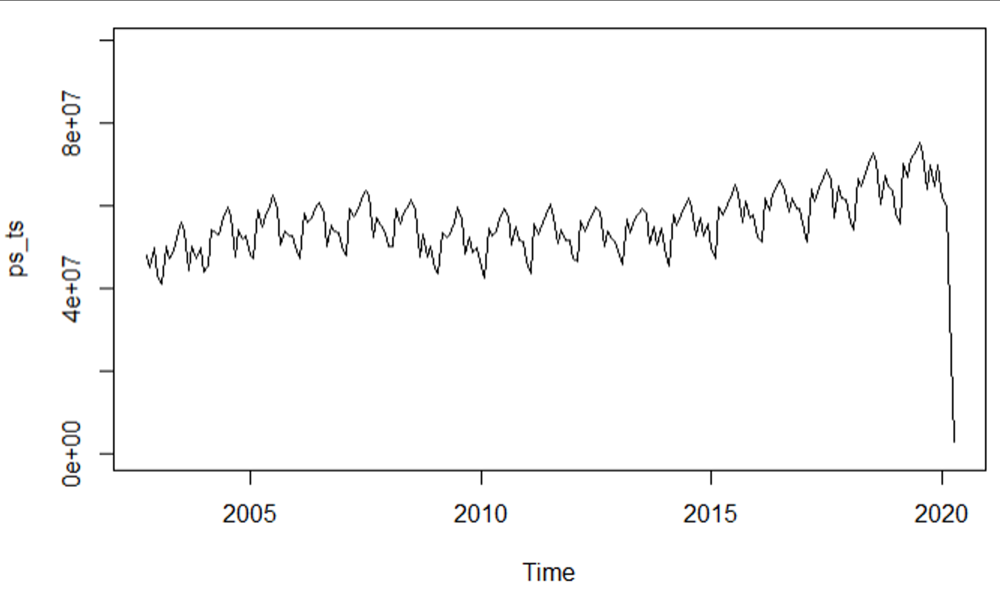

## Key Charts (ACF/PACF) & Interpretation
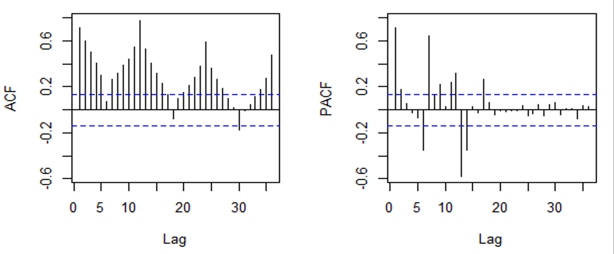

## First difference
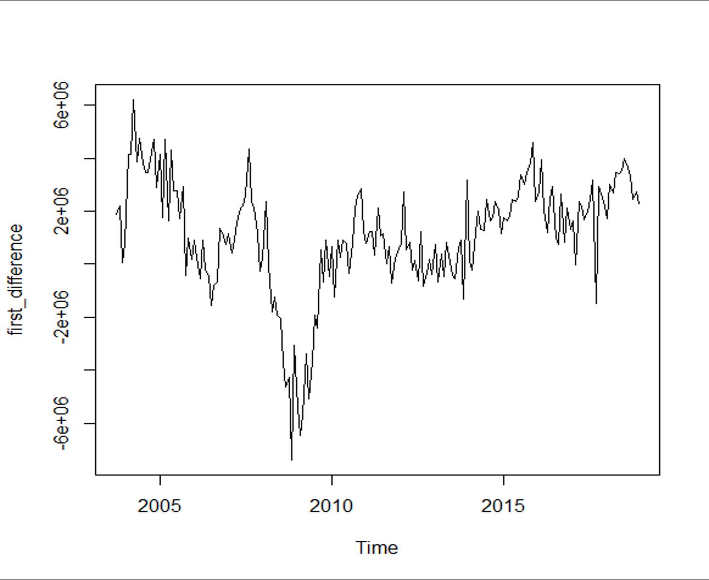

### KPSS test
H0: series is stationary
HA: series is not stationary
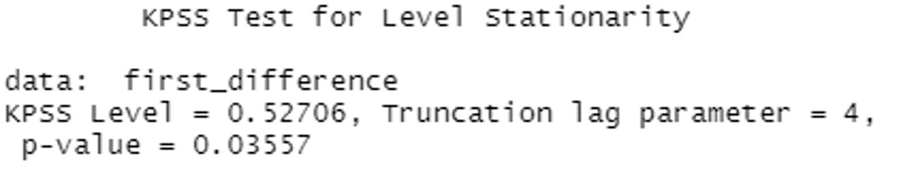

### Augmented Dickey-Fuller test
H0: series is not stationary
HA: series is stationary
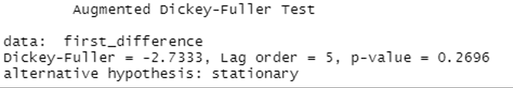

## Second difference
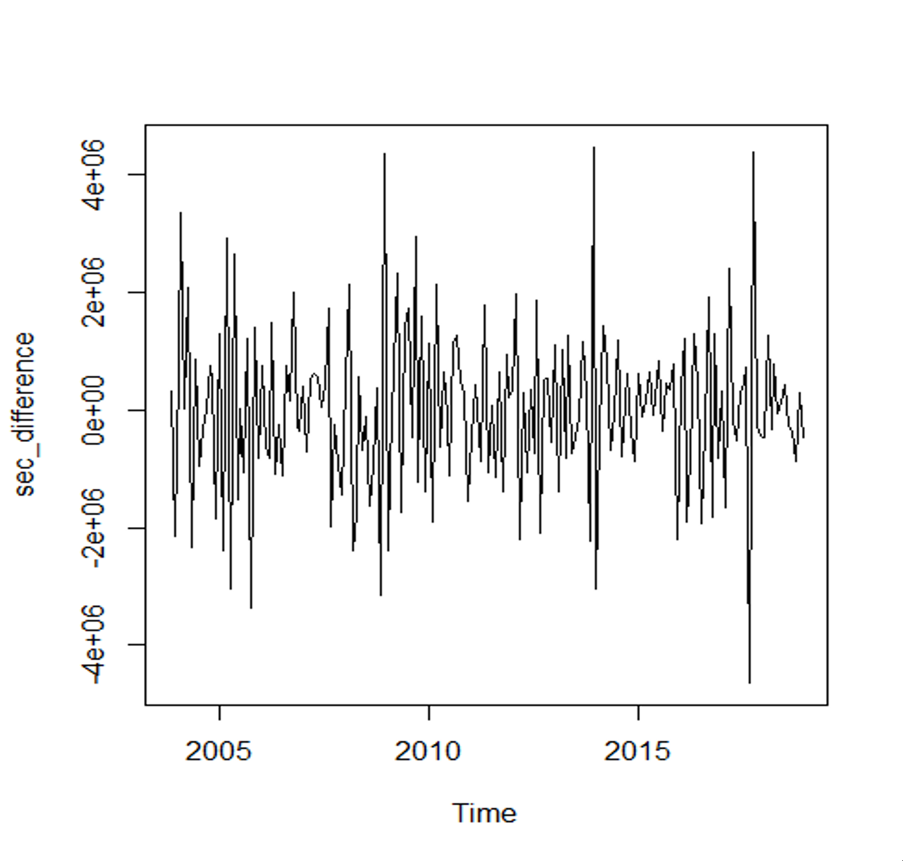

### KPSS test
H0: series is stationary
HA: series is not stationary
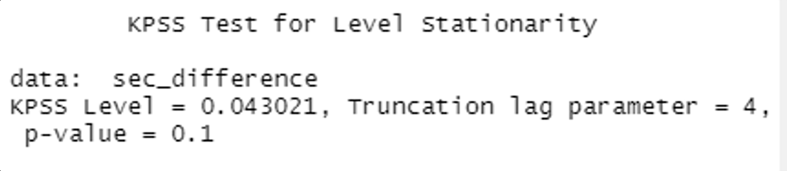

### Augmented Dickey-Fuller test
H0: series is not stationary
HA: series is stationary

## Ordinary Least Squares (OLS)

- Unemployment Level
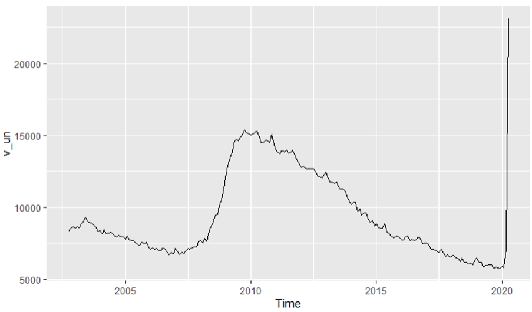

- Personal Savings (US)
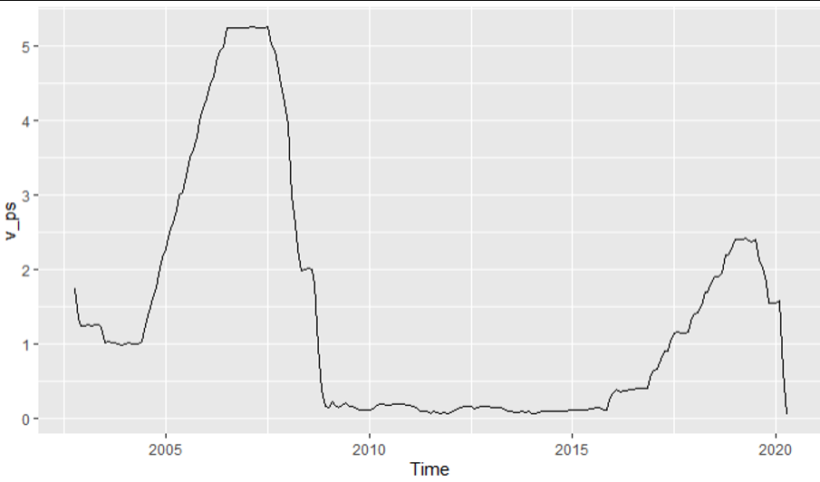

- Domestic Passenger Data
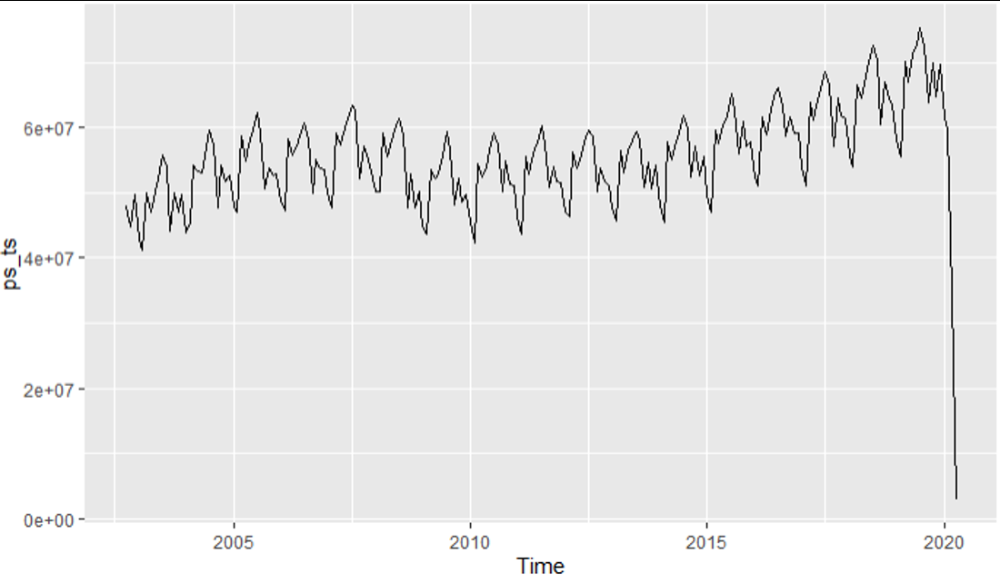

- Log Differenced Unemployment Level
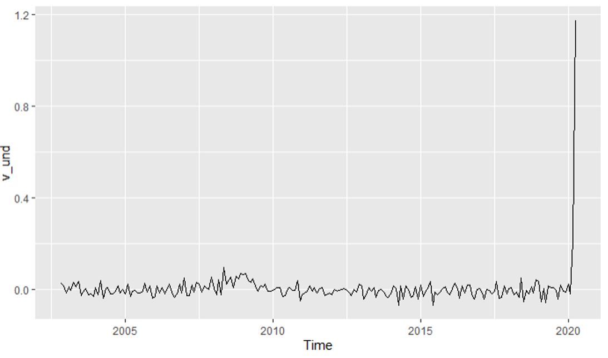

- Log Differenced Personal Savings (US)
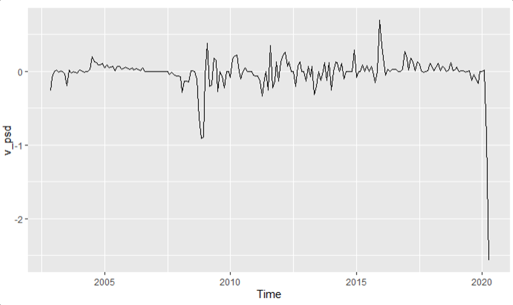

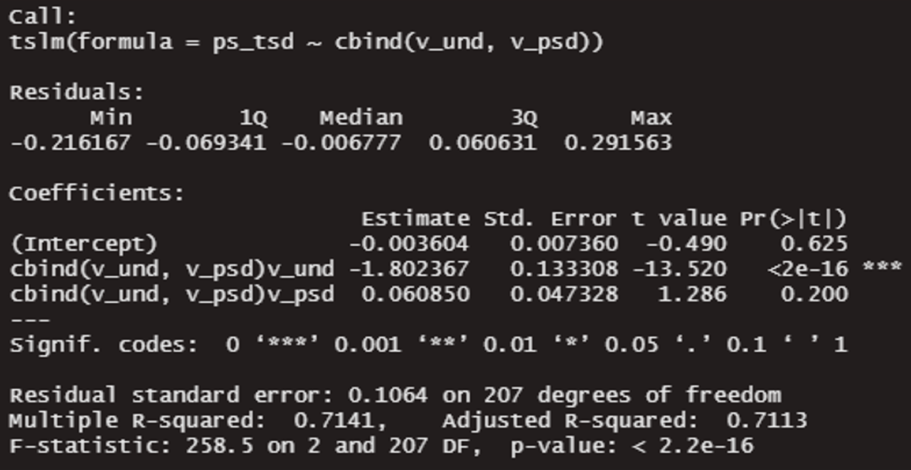

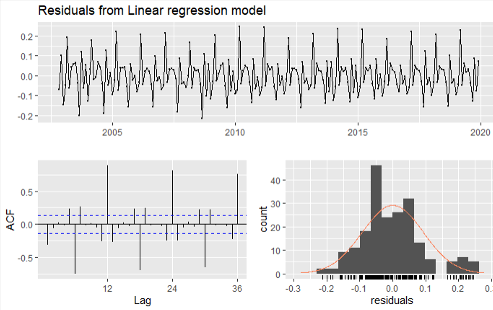

## Exponential Smoothing
Using the fpp2() library, we applied a couple methods for Exponential Smoothing
- Simple Exponential Smoothing and Holt’s Method
    - Used an algorithm to identify the optimal alpha and beta values respectively
    - Looked at lowest RMSE in relation to x-plot of alpha/beta values from 0 - 100
    - Then forecasted 12 months on differenced data
        - Used differenced approach to try to address clear trend
- Concluded that both models overfitted the data and despite forecasting on differenced data, saw our performance metrics remain higher for test/train
    - Lesson here reaffirms that it is difficult to apply SES and Holt on data with trend and seasonality like our plane data

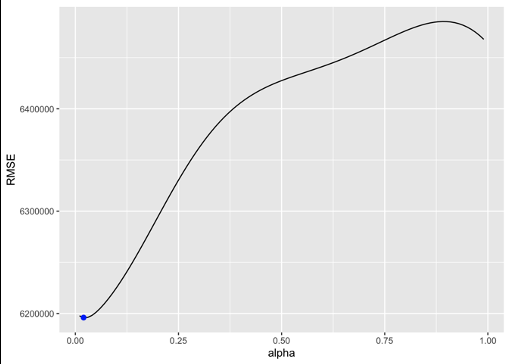
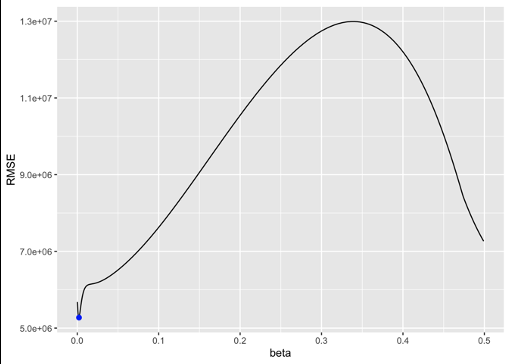

## Holt-Winters
Using hw() we forecasted the next 12 months of our T.S.
- We experimented with the following four methods
    - Linear trend with additive seasonality
    - Linear trend with multiplicative seasonality
    - Exponential smoothing
        - Linear trend with additive seasonality and damping
        - Linear trend with multiplicative seasonality and damping
- Comparing the four approaches, we identified our best Holt Winters model to be multiplicative with damped trend
    - The multiplicative approach makes sense because we, from plotting our time series object, we observe data with a positive trend but with seasonality that appears to increase over time
    - By dampening the trend to be turn flat over time, we achieve better accuracy metrics (lowest RMSE) as early as 12 months forecasted out

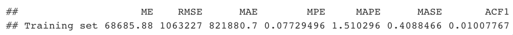
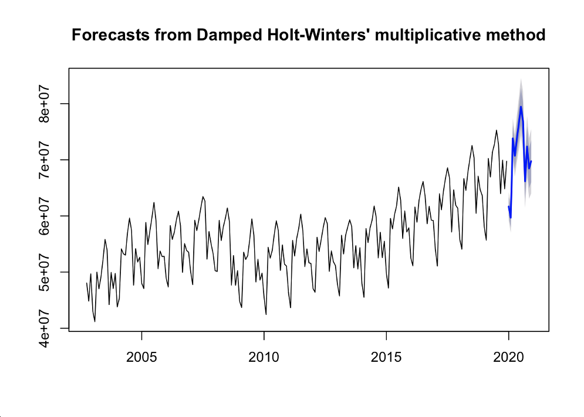

## ARIMA
An initial Auto-ARIMA identified our best model as an ARIMA(2,1,2)(1,1,2)[12].
- This makes sense, as there is a strong seasonal pattern, as well as a trend, implying the need for differencing
- Overall, this model performed well, with AICc 5590
- Could it be trimmed?

Tried multiple models
- Decreased Parameters
- Final ARIMA ARIMA(2,1,2)(0,1,2)[12]
    - Performed better on AICc; Error Metrics
- Residuals non concerning:

## VAR Modeling
- With a combination of international and domestic flight data, we were able to create a strong VAR model
    - We tried multiple, but inevitably a high order model was required to account for seasonality

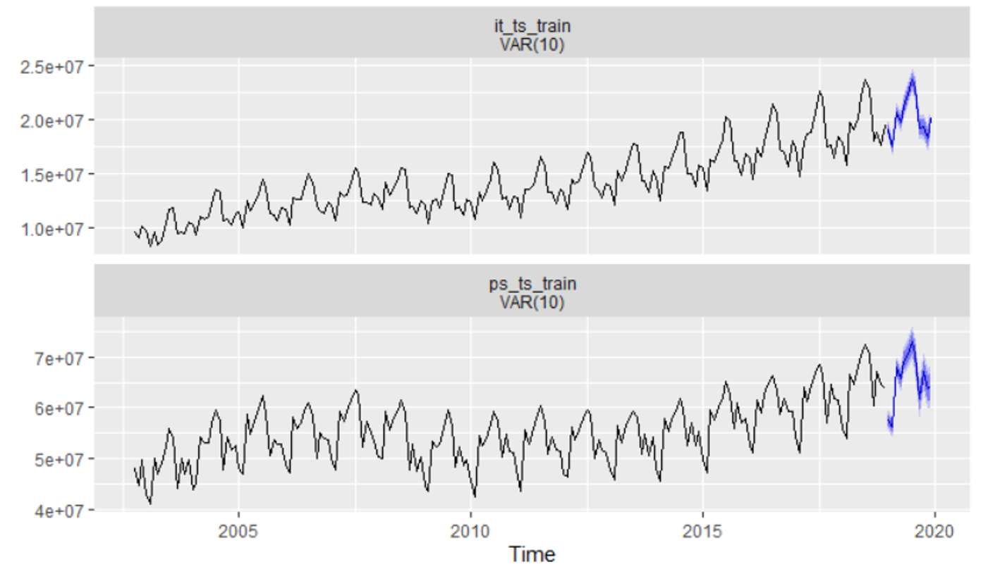

## Future Work
Given the unique circumstances surrounding 2020:
- Additional data could be added
- An intervention would need to be calculated
    - Pulse Function
    - Intervention effects that die out gradually:
    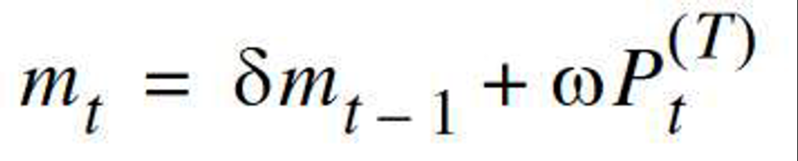
- A shorter window training window

## Conclusion - Performance
- Ultimately, the ARIMA model did better than any others
    - While the VAR would be expected to do well, variations between patterns of international and domestic travel prevented it from performing quite as strongly as the ARIMA
    - OLS was not able to properly use the time aspect of the dataset
    - This model outperformed holt-winters as well on RMSE and other statistics

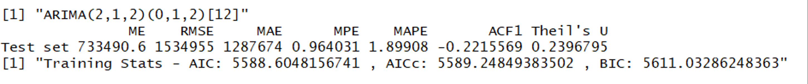

## Conclusion
Individual Contributions:
- Matt N: Intro, OLS, Future Work
- Elio: Key Charts, Data Overview, OLS
- Lev: Holt-Winters, Exponential Smoothing
- Matt F: Arima, VAR